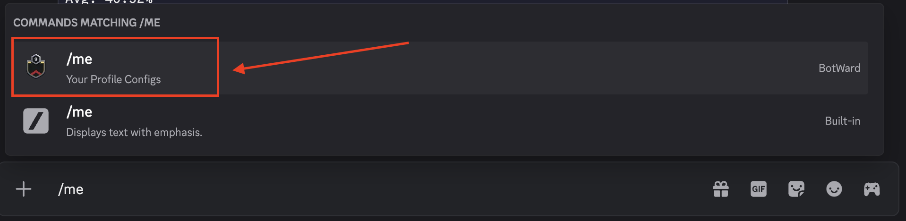
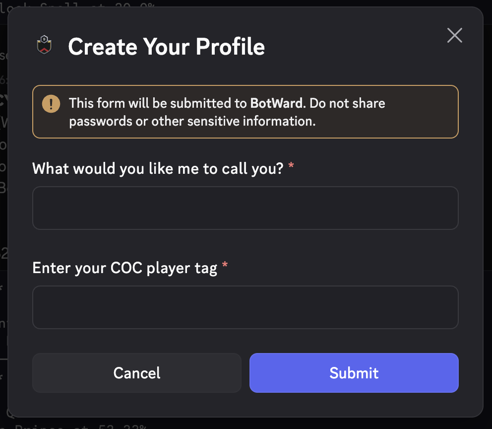
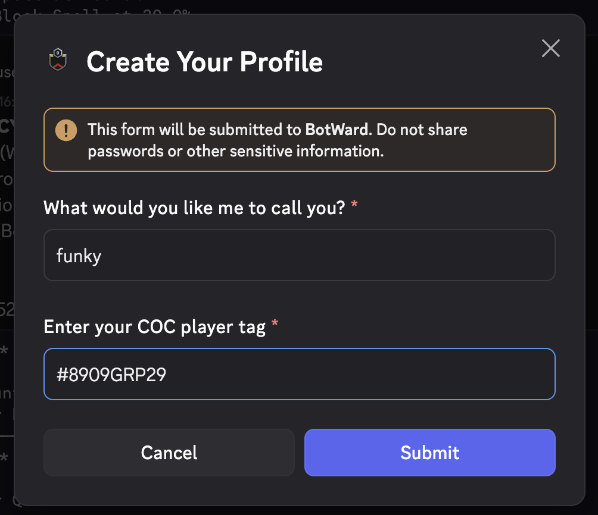

The `/me` command in botward discord bot allows you to create your profile, or edit it. Your profile contains information such as your username and your COC player tag, which will be used in other bot commands.

## Usage

To use this command, follow these steps:

1. Type `/me` in discord. An autocomplete menu will appear, where you can select the command and press "Enter".
   
2. Then, a modal will appear, where you can fill in your information.
   
   :::note
   If you had already created your profile, your information will be pre-filled in the modal, and you can edit them.
   :::
3. Once you have filled in your information as shown below, you can press "Submit" to create your profile (or edit it).
   
