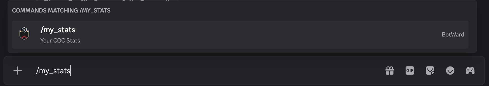
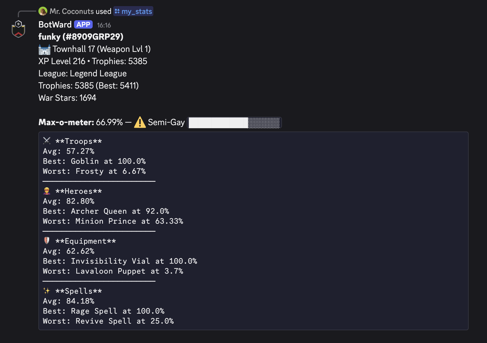

The `/my_stats` command in botward discord bot allows you view stats related to your clash of clans account.

:::note
This command will only work if you have created your profile using the `/me` command.
To create your profile, follow the [`/me` command guide](../me).
:::

## Usage

To use this command, follow these steps:

1. Type `/my_stats` in discord. An autocomplete menu will appear, where you can select the command and press "Enter".
   
2. Once you have executed the command, the bot will fetch your stats and display them in a public message.
   
