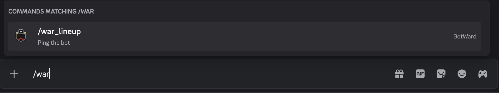
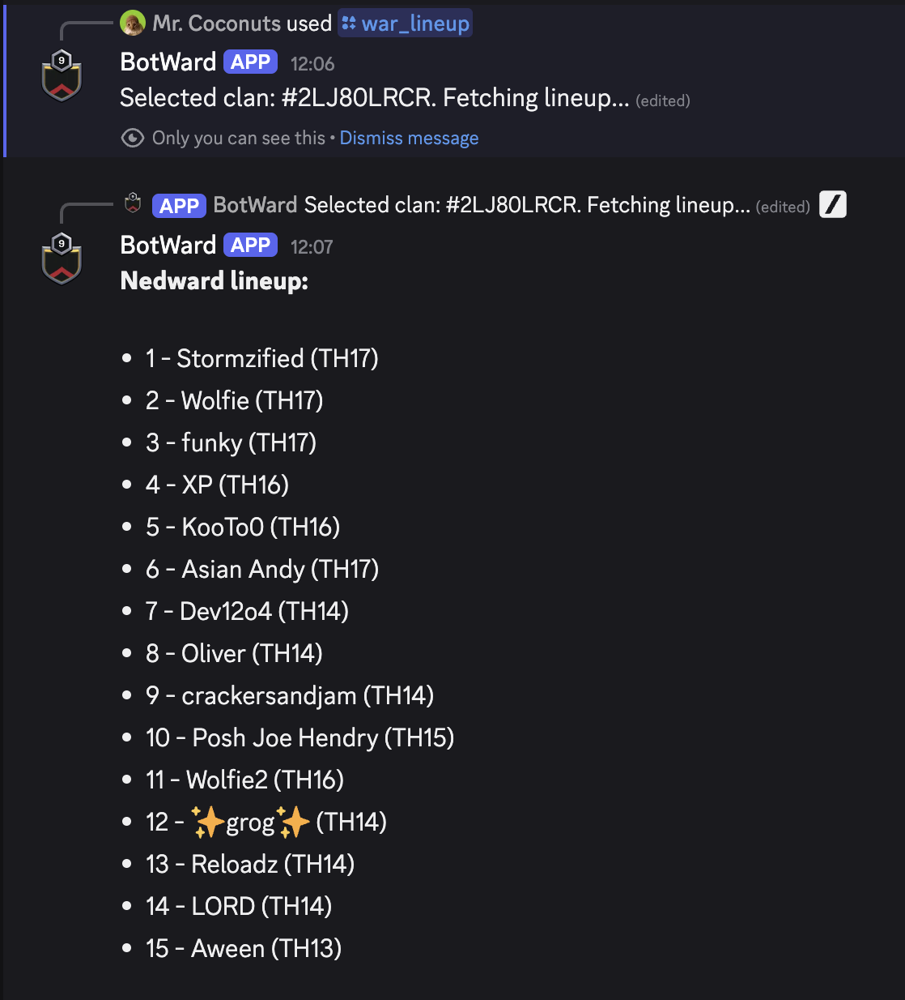

The `/war_lineup` command in botward discord bot allows you to see the war lineups of all the clans in your league group.

## Usage

To use this command, follow these steps:

1. Type `/war_lineup` in discord. An autocomplete menu will appear, where you can select the command and press "Enter".
   
2. The bot will then prompt you to select the clan you want to see the war lineup for. Please note that you can only select a clan from Nedward's CWL League Group.
   
3. Once you have selected the clan, the bot will fetch the war lineup for that clan and display it in a public message.
   
